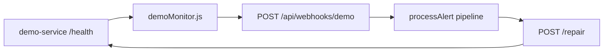

# AIMS - Automated Incident Management System

AI-powered multi-agent platform that automates the full incident lifecycle:
**Detection -> Alert -> Decision -> Action -> Resolution -> Reporting**

## Architecture

- **Backend**: Node.js + Express with 6 AI agents powered by Groq
- **Database**: Supabase (PostgreSQL) with real-time subscriptions
- **Frontend**: React 18 + Vite + TailwindCSS + Recharts
- **Real-time**: Socket.io for live incident updates
- **AI Agents (Python)**: LangChain + LangGraph; Node invokes agents via `python -m incident_management.bridge` (see `incident_management/`)

## Quick Start

### 1. Set up Supabase

1. Create a project at [supabase.com](https://supabase.com)
2. Go to SQL Editor and run the migration:

```sql
-- Copy and paste the contents of data/migration.sql
```

### 2. Configure Environment

```bash
cp .env.example .env
# Fill in:
# - SUPABASE_URL and SUPABASE_ANON_KEY (from Supabase project settings)
# - GROQ_API_KEY_1 (minimum 1 key, up to 3 for load distribution)
```

### 3. Install Dependencies

```bash
# Python agents (required for the incident pipeline)
python -m pip install -r incident_management/requirements.txt

# Node + frontend
cd server && npm install
cd ../client && npm install
```

### 4. Seed Sample Data

```bash
cd server && node seed.js
```

### 5. Start the Application

**Recommended:** from the repo root run **`npm run dev`** — it starts the API first, waits until `.aims-backend-port` is written (actual listen port), then starts Vite so `/api` proxy and Socket.io stay in sync even when port 5000 is busy.

Optional overrides: `client/.env.development` with `VITE_DEV_API_TARGET` (wins over the port file), or copy `client/.env.development.example`.

```bash
# One command (repo root — install root deps once: npm install)
npm run dev

# Or two terminals
cd server && npm run dev
cd client && npm run dev   # restart after API is listening so Vite picks up .aims-backend-port
```

- Frontend: http://localhost:5173
- Backend API: http://localhost:5000
- Health check: http://localhost:5000/api/health

## API Endpoints

| Method | Endpoint | Description |
|--------|----------|-------------|
| POST | /api/alerts | Ingest new alert (triggers full pipeline) |
| GET | /api/alerts | List all alerts |
| GET | /api/incidents | List incidents (filter by status/severity/service) |
| GET | /api/incidents/:id | Get incident detail with agent outputs |
| PATCH | /api/incidents/:id | Manual status override |
| GET | /api/reports/:incident_id | Get AI-generated report |
| POST | /api/reports/:incident_id/regenerate | Regenerate report |
| GET | /api/dashboard/kpis | MTTD, MTTR, automation rate |
| GET | /api/dashboard/timeline | Incidents over time |
| GET | /api/workflows | List workflow rules |
| POST | /api/workflows | Create workflow rule |
| POST | /api/webhooks/demo | Secured demo monitor webhook → same `processAlert` pipeline |

## Sandbox autonomous remediation demo

Optional hackathon flow: a tiny local **demo API** goes unhealthy, a **monitor** calls AIMS through a **shared-secret webhook**, the normal incident pipeline runs, and the action step can perform a **real** `POST /repair` on that API **only** when `ENABLE_REAL_SANDBOX_FIXES=true`. Resolution uses a real `GET /health` probe for `demo-api` in that mode; otherwise behavior stays simulated and matches the legacy health check.

**Architecture (high level)**



**Configure** (see `server/.env.example`): set `WEBHOOK_SHARED_SECRET` (required for the webhook route), optionally `ENABLE_REAL_SANDBOX_FIXES=true`, `DEMO_SERVICE_URL`, `DEMO_WEBHOOK_URL`, `DEMO_MONITOR_INTERVAL_MS`. For webhook-only demos without CSV noise, set **`ENABLE_CSV_POLLING=false`** (skips `startAlertPolling` / `data/alerts.csv` ingestion).

**Run (four processes)**

1. Backend: `npm run dev` from repo root (or `cd server && npm run dev`).
2. Frontend: included in root `npm run dev`, or `cd client && npm run dev`.
3. Demo API: `npm run demo:service` (from repo root) — listens on `DEMO_SERVICE_PORT` (default `5055`).
4. Monitor: `npm run demo:monitor` — polls `GET /health` and posts to `/api/webhooks/demo` on healthy→unhealthy transitions (with cooldown).

**Break the service during a presentation**

- `npm run demo:break`, or `curl -X POST http://127.0.0.1:5055/break`

**Expected dashboard behavior**

- After `/break`, the monitor sends one webhook per transition (cooldown prevents floods). A new incident appears for `demo-api` / `api_failure`. Agent activity progresses through decision → action → resolution. With **real fixes enabled**, the action agent hits the sandbox repair URL; resolution confirms via HTTP `200` on `/health`. With **real fixes off**, remediation stays simulated and the existing simulated health path applies so CSV/demo flows are unchanged.

**Safety defaults**

- Real HTTP repair is allowlisted to `service === "demo-api"` and actions `restart_api_service` / `restart_service` only, gated by `ENABLE_REAL_SANDBOX_FIXES=true`. No arbitrary shell execution. The dedicated webhook route rejects requests if `WEBHOOK_SHARED_SECRET` is unset or the `x-webhook-secret` header does not match.

## Pipeline Flow

```
Raw Alert -> Detection Agent (classify, enrich, deduplicate)
          -> Decision Agent (match rules, safety checks)
          -> Action Agent (generate commands, execute)
          -> Resolution Agent (health check, retry/escalate)
          -> Reporting Agent (RCA, timeline, recommendations)
```

Each agent uses Groq AI with structured JSON output. Three API keys are distributed across agents to avoid rate limits.

## Project Structure

```
aims/
  demo-service/         - Sandbox Express API (/health, /break, /repair) for live demos
  incident_management/  - Python agents, LangGraph graph, bridge (Groq via LangChain)
  server/
    demo/               - Health monitor + triggerBreak helper
    config/       - Supabase, environment config
    engine/       - Orchestration pipeline, workflow engine, safety guards
    models/       - Supabase data access layer
    routes/       - Express API routes
    services/     - CSV parser, action executor, notifier, logger
    sockets/      - Socket.io event handlers
    jobs/         - CSV alert polling
  client/
    src/
      components/ - Dashboard, Incidents, Reports UI components
      hooks/      - useSocket, useIncidents (React Query)
      store/      - Zustand state management
      pages/      - Dashboard, Incidents, Reports, Escalation pages
  data/
    alerts.csv    - Sample alert data
    workflows.csv - Remediation rules
    migration.sql - Supabase schema
```
